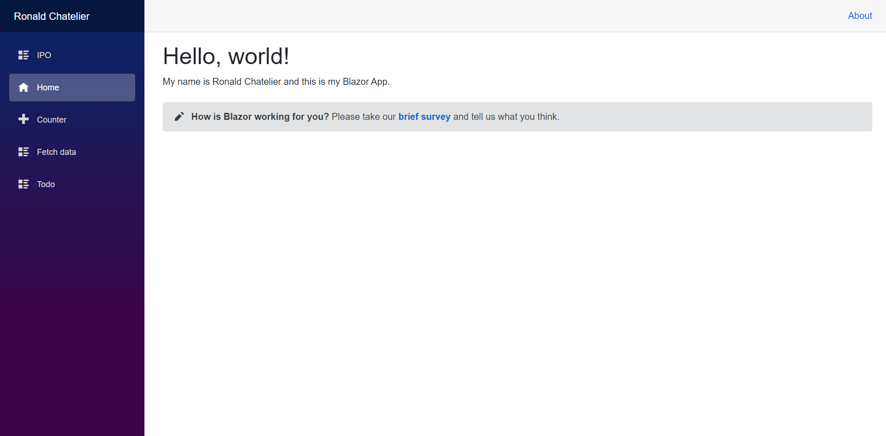

# Blazor Starter Application

The purpose of this project is to get the understanding of Blazor and the functionality of it with different tabs and inputs. 

## Sources Used
Make a project on your computer that runs with .NET: https://dotnet.microsoft.com/learn/aspnet/blazor-tutorial/intro

Make a project on GitHub that runs with Azur: https://devblogs.microsoft.com/aspnet/azure-static-web-apps-with-blazor/

Build a Blazor todo list app: https://docs.microsoft.com/en-us/aspnet/core/tutorials/build-a-blazor-app?view=aspnetcore-5.0&pivots=server

Blazor Application Website: https://jolly-smoke-0774edb0f.azurestaticapps.net

## Blazor Application Running

